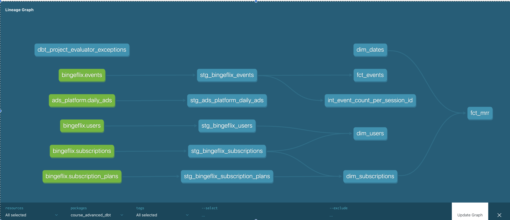

# CoRise Advanced DBT - Week 1 Project

# **Week 1: Project Instructions**

## **Introduction**

Welcome to your Week 1 project! With this first project, you will step into the shoes of a new team member who has just joined the data team at **Bingeflix**. The data team has been using dbt for a little over a year, and is starting to run into some of the challenges we've learned about this week.

## **Project Details**

### **Business background**

Imagine you have just joined the data team as a Senior Analytics Engineer at a company called Bingeflix, a rapidly growing video-streaming company that aims to be a major player in the entertainment industry. Since its inception in 2019, Bingeflix has established a loyal subscriber base due to its vast collection of TV shows and movies, including exclusive content that cannot be found anywhere else. With a commitment to innovation and customer satisfaction, BingeFlix aims to be a major competitor to industry leader, Netflix, by the end of 2025.

### **Dataset description**

Bingeflix uses four main database tables that service their data models:

[data:image/svg+xml,%3csvg%20xmlns=%27http://www.w3.org/2000/svg%27%20version=%271.1%27%20width=%27568%27%20height=%27667%27/%3e](data:image/svg+xml,%3csvg%20xmlns=%27http://www.w3.org/2000/svg%27%20version=%271.1%27%20width=%27568%27%20height=%27667%27/%3e)

[https://corise.com/_next/image?url=https%3A%2F%2Fcorise-ugc.com%2Fstatic%2Fcourse%2Fadvanced-dbt%2Fassets%2Fclhi7jvzd001p136ccy9udizn%2FScreen%2520Shot%25202023-05-10%2520at%25205.23.28%2520PM.png&w=1200&q=75](https://corise.com/_next/image?url=https%3A%2F%2Fcorise-ugc.com%2Fstatic%2Fcourse%2Fadvanced-dbt%2Fassets%2Fclhi7jvzd001p136ccy9udizn%2FScreen%2520Shot%25202023-05-10%2520at%25205.23.28%2520PM.png&w=1200&q=75)

### **Bingeflix project DAG**

[data:image/svg+xml,%3csvg%20xmlns=%27http://www.w3.org/2000/svg%27%20version=%271.1%27%20width=%271386%27%20height=%27492%27/%3e](data:image/svg+xml,%3csvg%20xmlns=%27http://www.w3.org/2000/svg%27%20version=%271.1%27%20width=%271386%27%20height=%27492%27/%3e)

[https://corise.com/_next/image?url=https%3A%2F%2Fcorise-ugc.com%2Fstatic%2Fcourse%2Fadvanced-dbt%2Fassets%2Fcljz02r8h02y4124uevqm1xkb%2FScreen%2520Shot%25202023-07-11%2520at%25208.45.40%2520PM.png&w=3840&q=75](https://corise.com/_next/image?url=https%3A%2F%2Fcorise-ugc.com%2Fstatic%2Fcourse%2Fadvanced-dbt%2Fassets%2Fcljz02r8h02y4124uevqm1xkb%2FScreen%2520Shot%25202023-07-11%2520at%25208.45.40%2520PM.png&w=3840&q=75)

### **Task 1: Familiarize with the Bingeflix dbt project repo**

1. [Gitpod.io](http://Gitpod.io) - set up workspace (Done)
2. Familiarize yourself with the Bingeflix dbt project by reviewing the existing models, documentation, and modeling layers. You can also see an overview of the dataset with descriptions **[here](https://corise.com/course/advanced-dbt/v2/module/wip-bingeflix-overview)**.

### **Task 2: Add docs blocks to populate missing documentation and maintain consistency**

1. Added doc_source.md files in the models/docs/ directory for each source and chose to populate as many yml files as possible.
2. Added description: `'{{ doc("column_id_goes_here") }}'` to each .yml file

    Hint: Be sure that your documentation is consistent for columns of the same name!

3. Run `dbt docs generate` and `dbt docs serve` to confirm the documentation populated as expected. You can toggle the course_advanced_dbt and leave out the tables for the dbt packages listed in the dbt_project.yml

### **Task 3: Install dbt_project_evaluator package to enforce best practices**

1. After putting in the project into dbt_project.yml run `dbt deps` to install
2. Run the command `dbt build -s package:dbt_project_evaluator dbt_project_evaluator_exceptions`

    Review the warnings identified and decide how your want to resolve them.

    1. Put the following syntax into dbt_project.yml to see the error and a more human readable table output.
        1. `on-run-end: "{{ dbt_project_evaluator.print_dbt_project_evaluator_issues() }}”`
        2. Look at the table `fct_root_models`
        3. Moved the mrr labelled models to fct_mrr.sql and fct_mrr.yml to clear errors. Reference

        [Modeling subscription revenue](https://www.getdbt.com/blog/modeling-subscription-revenue/)

3. Your goal for this task should be to resolve all warnings identified by the package.
    1. I left the dim_dates alert along because I chose to move the dimension to models/marts/dates
    2. I applied the fct prefix to mrr.sql and mrr.yml to clear the errors and follow standard naming conventions
4. In the project submission box, provide a short explanation for why you chose to resolve the issues in the way you did to demonstrate your understanding of how to work with this package. Some examples of this might look like:

## CoRise Adv DBT docs generated DAG Week1 Project

